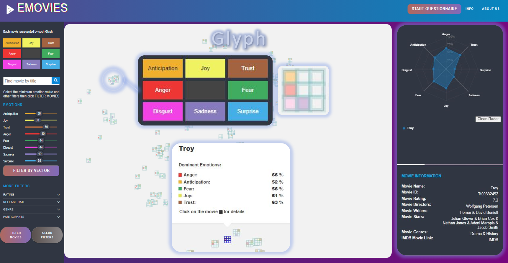
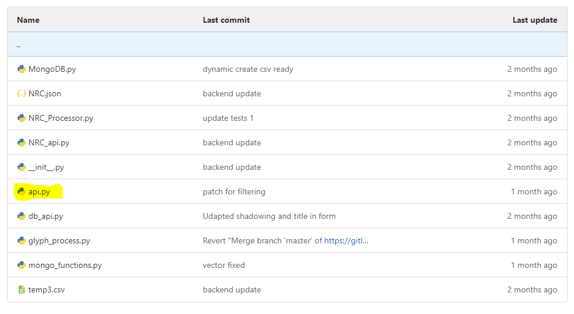
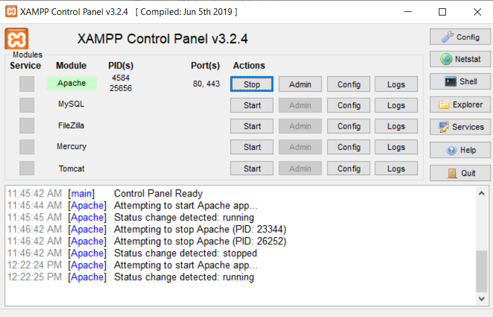
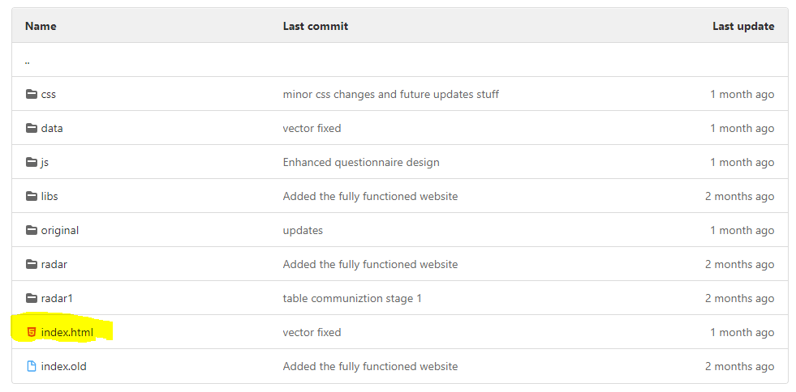

##### See all IMDB users emotions!!!

The system provides all IMDB users reviews and creates a visualiztion of their feelings 

## Prerequisites

1. XAMPP
2. Python3.7
3. MongoDB
4. MongoCompass

## Setup

After prerequisites are prepared next steps nust be done:

1. Clone repository into htdoc provided be XAMPP
2. Run server 
3. Run client

#### Server-Side

To run the server-side go the backend package and run api.py

#### Client-Side

To run client-side first you need to run webserver provided by XAMPP

Second go to website package and open index.html in your favorite browser

## Backend

The backend package provides features for processing, managing DB and agggregating data collected by the scrapper, making it the core of the  application

Main Features:
1. Api for managing MongoDB
2. Protocols for data proccesing
3. TSNE model training 
4. Api for querying MongoDB

More details provided in backend README

## Frontend

The frontend package provides visualiztion and functions for querying emotional glyphes

Main Feature:
1. Glyph Map
2. Filters
3. Questionnaire
4. Radar

More details provided in website package README

## Scrapper

The scrapper package provides interface and functions for scrapping https://www.imdb.com/?ref_=nv_home

The reviews collected are saved in JSON format, and then proccesed and inserted into MongoDB

More details in scrapper package README

