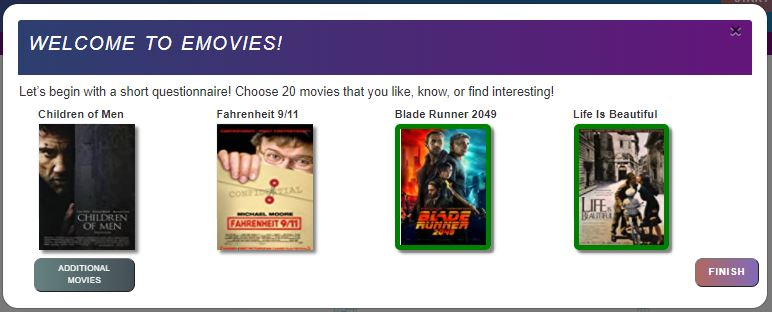
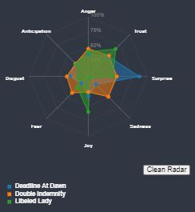
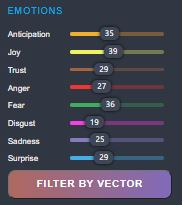
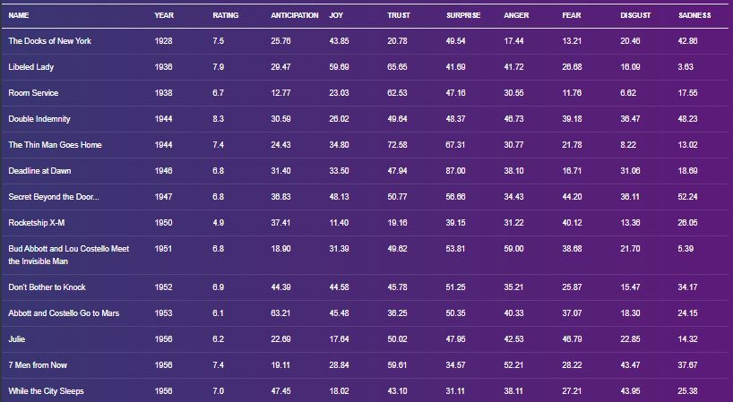

# Frontend

## Main Features
1. Questionnaire
2. Radar
3. Filters
4. Table

## Script Per Component 

Each component is implementd in differet JS file.  

### Questionnaire

Questionnaire code present at: form.js

The questionnaire shows pictures of movies:
1. Top 250 most reviewed movies in IMDB. 
2. Shows 4 movies every time - refreshable by the user.
3. 1 Minimum - 20 Maximum. 
4. Click finish for a calculated Vector and results. 

The line "if (selected_videos.length <= 20) {" - Determines the amout of maximum selectable movies by the user.

Changing the number will limit the user (more or less). 

### Radar

Radar code present at: RadarChart.js

### Filters

Sliders code present at: emotions-filter-slider.js

### Table

Shows all currently diplayed movies data in a table format.

All rows are clickable and open a radar chart for comparisons. 

Table code present at: table.js

The line "let filetoload = "data.csv";" 

Loads the data file with movies path: "./website/data/data.csv". 

