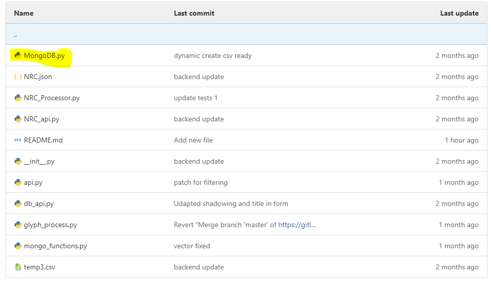
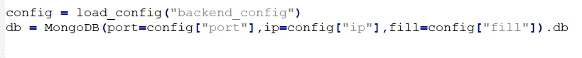
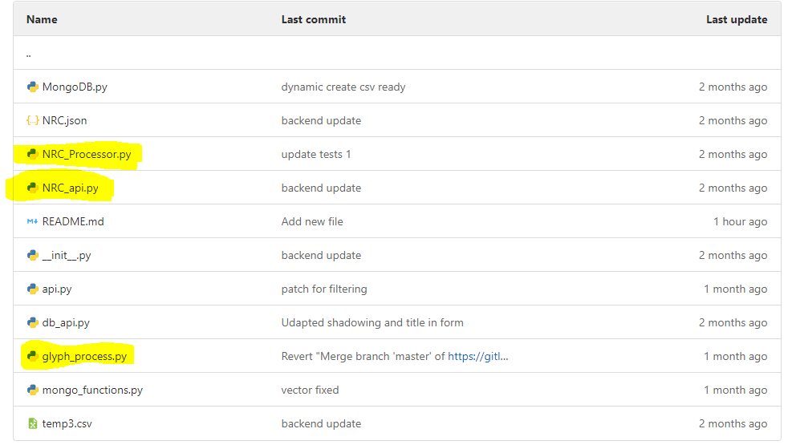
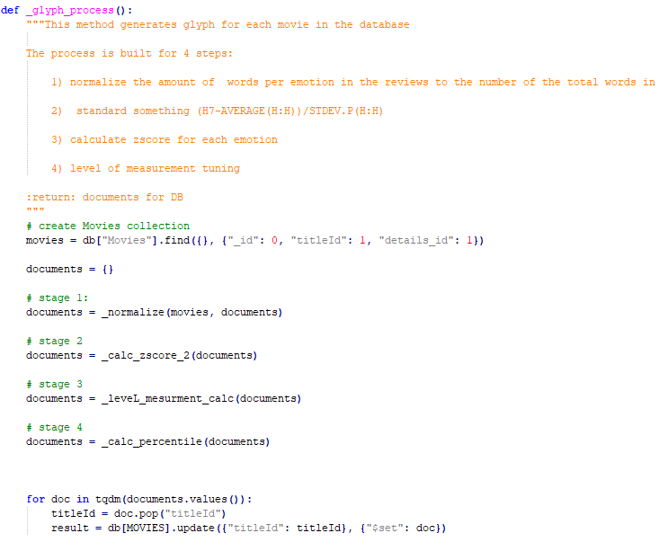
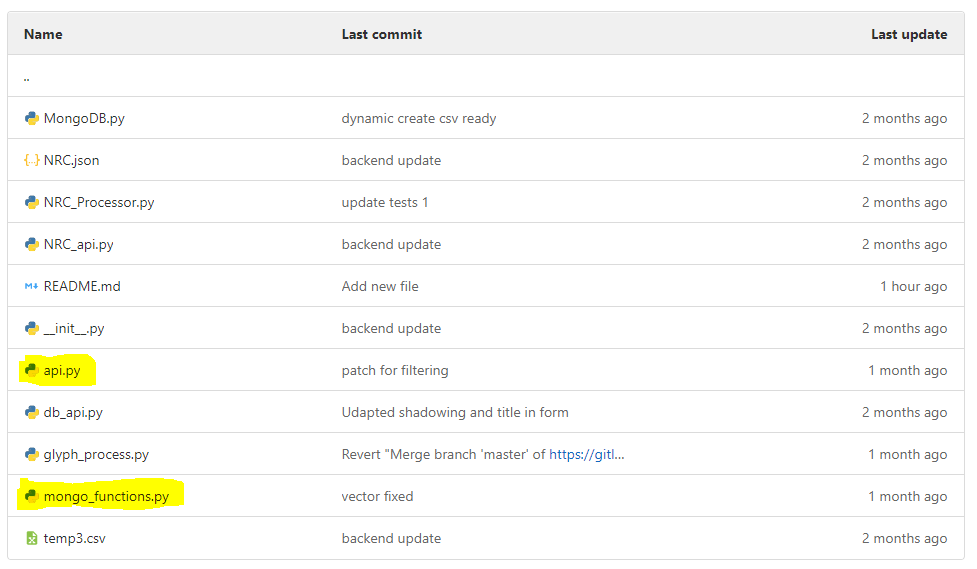

# Backend

## Main Features
1. Mongo Management 
2. Processing
3. Querying API

## Mongo Management

Managing the DB is happening throw MongoDB singelton class, this class is wrapper for MongoClient provided by pymongo

The main idea of this class is to sync the DB with the data gathered by scrapper

## Processing

The data processing is handled by glyph_process and NRC_Processor, this file containes all methoed used for creating glyphes stored in the DB

## Querying API

The API is handled by two files:

1. api.py is a server which listens for incoming http resquests
2. mongo_function.py which that implements the queries

