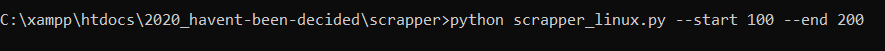

# Scapper

This package provides a tool for scrapping reveiws from IMDB. The interface used is CLI, which demands from the user to provide title number from which the scrapping will start and final number where it will end. 

#### There are two versions provided:
1) scrapper_linux.py - scrapper for linux 
2) scrapper_win.py - scrapper for windows 

* SCRAPPING ALL TITLES FROM "totalmovies2.csv" - this is the file where titles should be put in, to scrape them.

Results will be saved in JSON file in dictionary data 
